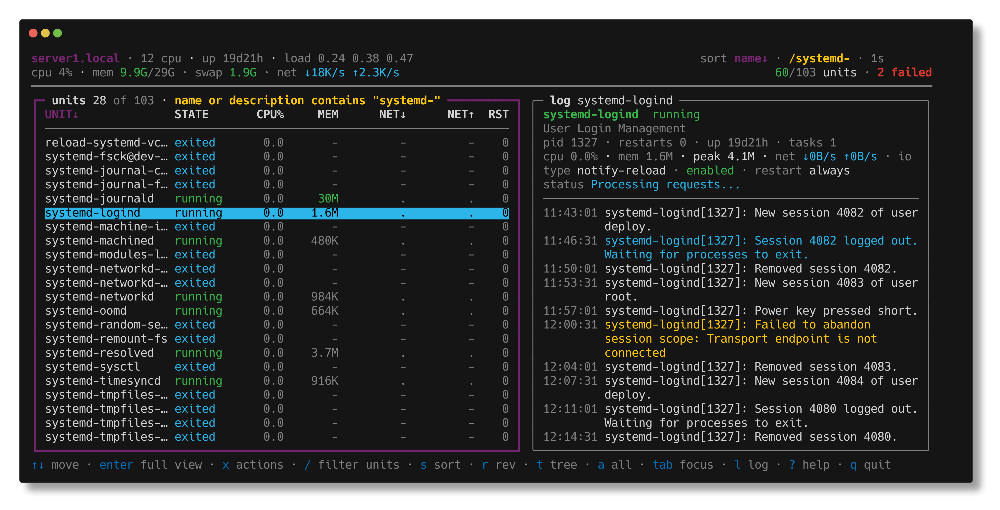
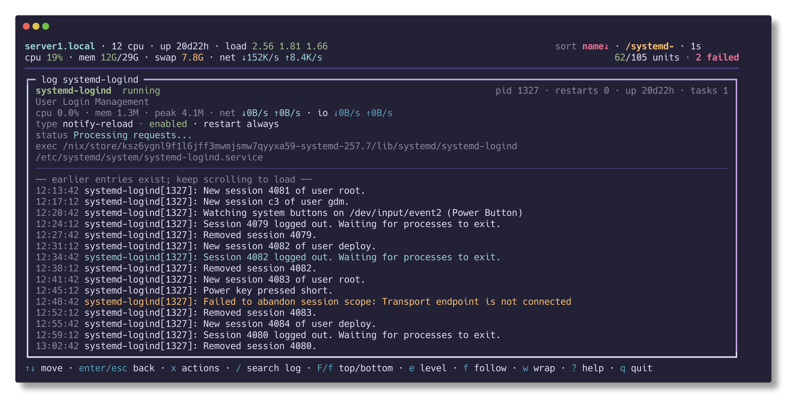
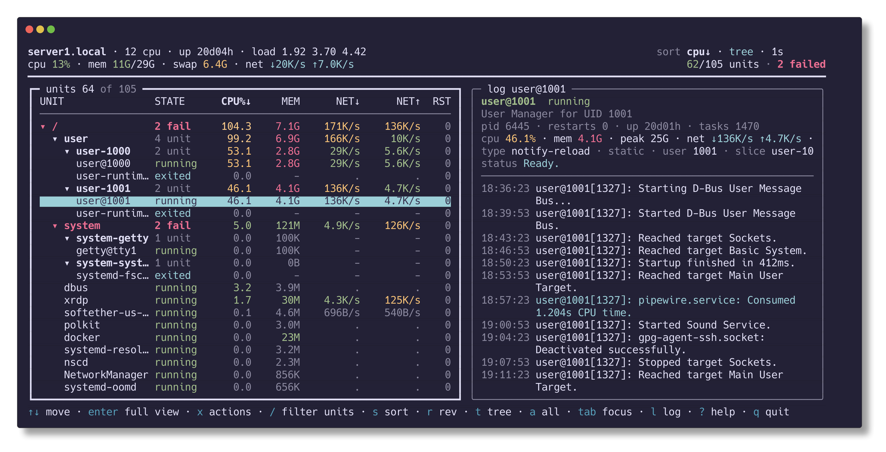
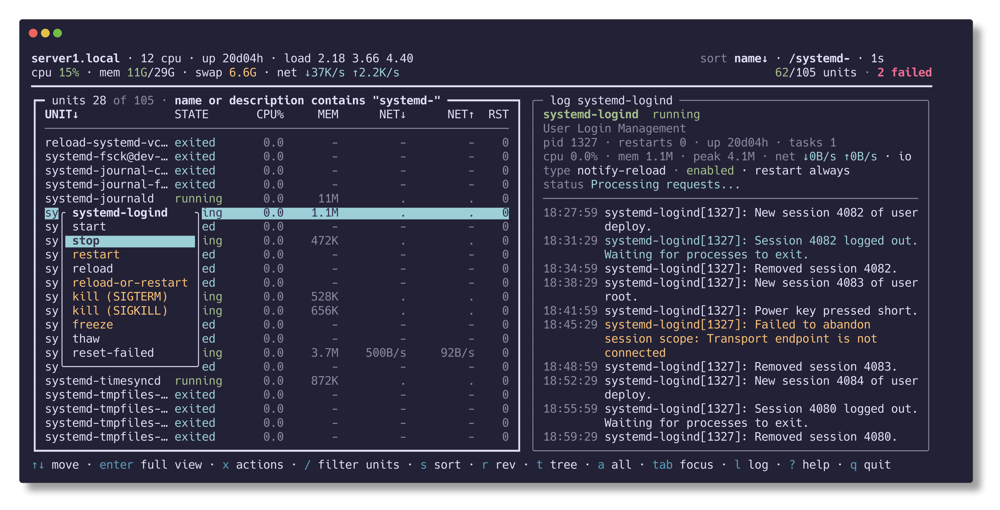

# unitop

A terminal UI for watching systemd services: per-unit CPU, memory, network
and disk I/O rates, failure state and restart counts in a sortable table, a
live journal tail beside it, a slice tree, and start/stop/kill from a menu.

[](https://github.com/sagar-chandarana/unitop-go/actions/workflows/ci.yml)
[](https://github.com/sagar-chandarana/unitop-go/releases/latest)
[](LICENSE)



> **Pre-1.0.** It does what it says and is used daily, but flags, keys and
> output are still open to change. Pin a tag if that matters to you, and see
> the [changelog](CHANGELOG.md) for what moved.

Works on the local machine, or on any host you can reach over ssh:

```sh
unitop                     # this machine
unitop -H root@server1     # a remote host
```

## Install

### Nix

```sh
nix run github:sagar-chandarana/unitop-go              # run it once
nix profile install github:sagar-chandarana/unitop-go # install it
```

As a flake input:

```nix
{
  inputs.unitop.url = "github:sagar-chandarana/unitop-go";

  # in a NixOS module, with inputs in specialArgs:
  environment.systemPackages = [
    inputs.unitop.packages.${pkgs.system}.default
  ];
}
```

There is an overlay too, if you prefer `pkgs.unitop`:

```nix
nixpkgs.overlays = [ inputs.unitop.overlays.default ];
```

### Download a binary

Static, no runtime dependencies — drop it on any Linux host:

```sh
REL=https://github.com/sagar-chandarana/unitop-go/releases/latest/download
BIN=unitop-linux-amd64     # or unitop-linux-arm64
curl -fsSL -O "$REL/$BIN"
chmod +x "$BIN" && ./"$BIN"
```

Verify it first if you like — keep the downloaded name, since that is what the
checksums refer to:

```sh
curl -fsSL -O "$REL/SHA256SUMS"
sha256sum -c SHA256SUMS --ignore-missing
```

Put it on your `PATH`:

```sh
sudo install -m755 "$BIN" /usr/local/bin/unitop
```

Install it onto a remote host and run it there, in one go:

```sh
HOST=root@server1
ssh "$HOST" "curl -fsSL -o /usr/local/bin/unitop \
  $REL/unitop-linux-amd64 && chmod +x /usr/local/bin/unitop"
ssh -t "$HOST" unitop
```

Or leave the remote untouched and drive it from here, which is what `-H` is
for:

```sh
unitop -H root@server1
```

### From source

```sh
git clone https://github.com/sagar-chandarana/unitop-go
cd unitop-go/src && go build .
```

## Supported systems

| | |
| --- | --- |
| **OS** | Linux with systemd. That is the whole subject matter — there is no macOS, BSD or Windows build. |
| **Arch** | `amd64` and `arm64` binaries are published; anything Go targets builds from source. |
| **systemd** | **251 or newer** (May 2022) — the first release whose `systemctl show --timestamp=unix` exists: v250's `--timestamp` knows only pretty/us/utc/us+utc. unitop checks on startup and tells you if the host is older. Tested against 257 and 258; 229, 247 and 250 are correctly refused. Counters a release does not report — IP accounting, `MemoryPeak` — show as `-`. |
| **Terminal** | Any ANSI terminal. Colours are the terminal's own sixteen, as htop uses, so unitop matches your theme — light or dark — rather than imposing one. Mouse optional. |
| **Privileges** | None to watch CPU/memory. The journal needs the `systemd-journal` group or root; unit actions need root or `-sudo`. |

## Usage

```
unitop [flags]

  -H user@host   watch a remote host over ssh (key auth only)
  -i 2s          refresh interval (default 1s, clamped to 250ms-30s)
  -s cpu         initial sort column
  -r             reverse the initial sort
  -t             start in tree view, grouped by slice
  -a             include inactive/dead units
  -f nginx       initial filter
  -no-logs       start with the log pane hidden
  -sudo          run unit actions through 'sudo -n systemctl'
  -read-only     remove the action menu entirely
  -v             print version
```

Sort columns: `name state cpu mem net net-out io io-write restarts tasks
uptime`.

## Keys

Most keys belong to a pane rather than to the program. The focused pane is
drawn in a heavy, coloured box; `tab` moves between them. A key belonging to
the other pane does nothing, and the footer lists only what applies where you
are — so what is on screen is what the next keystroke will do.

**Either pane**

| key | action |
| --- | --- |
| `↑` `↓`, `pgup`/`pgdn`, `home`/`end` | move; scrolls the log when it has focus |
| `tab` | move focus between the table and the log |
| `enter` | full view for a unit; expand/collapse a slice |
| `x` | start / stop / restart / kill the selected unit |
| `esc` | step back one (see below) |

`esc` pops exactly one thing per press, innermost first:

1. cancel what you are typing — the filter goes back to what it was, it is not
   thrown away
2. close the action menu, or back out of its confirmation
3. close this help
4. clear the **focused pane's** filter — the unit filter from the table, the
   search and level from the log
5. leave the full view
6. return focus to the table

It never reaches past the first of those that applies, so nothing you cannot
see gets cleared.

**The unit list**

| key | action |
| --- | --- |
| `/` | show only units whose name or description contains the text |
| `s` / `S` | sort by the next / previous **visible** column |
| `r` | reverse the sort |
| `t` | tree view, grouped by slice |
| `a` | include inactive/dead units |
| `←` `→` | collapse / expand a slice in tree view |

**The log**

| key | action |
| --- | --- |
| `/` | show only journal lines matching the text (a `journalctl` regex) |
| `e` | level: everything → warning and above → error and above |
| `F` / `f` | top / bottom of the log |
| `f` | the bottom is the live end, so `f` follows too; scrolling up stops it |
| `w` | wrap long lines |

`F` and `f` are the only letters bound to motion anywhere, and they are the
log's because it is the only pane with two ends worth naming — the table's are
just `home` and `end`.

**Anywhere**

| key | action |
| --- | --- |
| `l` | show or hide the log pane |
| `p` | pause polling |
| `R` | refresh now |
| `+` / `-` | faster / slower refresh |
| `?` | help |
| `q` | quit |

Whatever a filter is doing sits in its pane's title, in words — `units 12 of
340 · name or description contains "nginx"`, or `log nginx.service · matching
"denied", error and above`. A filtered pane that did not say so would read as a
quiet one. `esc` clears the filter of the pane you are in.

The mouse works too: the wheel scrolls whichever pane it is over, a click on a
**column header** sorts by it (again to reverse), a click on a slice's `▾`
toggles it, and a **right click on a unit** opens the action menu.

## Full view

`enter` on a unit drops the table and gives that unit's log the whole width.
Above it sits everything worth knowing about the service: pid, uptime, tasks
and restarts; live CPU, memory, network and I/O; how it is configured (`type`,
whether it is `enabled`, its restart policy, the user and slice it runs in,
what socket or timer triggers it); whatever it reports of itself through
`sd_notify`; the command it actually runs; and the unit file it came from.
`esc`, or `enter` again, goes back.

The side pane shows as much of the same as fits beside the table.



## Tree view

`t` groups units by slice, following the nesting implied by slice names
(`user-1001.slice` under `user.slice`). Each slice row totals everything
beneath it — CPU, memory, network, I/O, tasks, restarts — and turns red with
`N fail` when a descendant has failed.



## Unit actions

`x`, or a right click, offers start, stop, restart, reload, reload-or-restart,
kill with SIGTERM or SIGKILL, freeze, thaw and reset-failed. Anything that
interrupts a running service asks for confirmation and is drawn in orange.



Actions run `systemctl` directly, so they need privilege: run as root, or pass
`-sudo` to route them through `sudo -n systemctl`. Interactive polkit is never
used — it would take over the terminal — so an unprivileged run reports
`Interactive authentication required` and suggests `-sudo`. `-read-only`
removes the menu entirely.

## Logs

The pane starts with the last 500 entries for the selected unit and follows.
Scroll to the top and it fetches the previous 500, and keeps going as you keep
scrolling — so the buffer is a window onto the journal rather than all there is.
The top line always says which: `loading earlier entries…` while a page is in
flight, `beginning of this unit's journal` when there is genuinely nothing
older, and otherwise that more exists and scrolling will load it.

Paging uses journald cursors, so pages join exactly — no duplicated or skipped
entries. Switching units starts over.

Log text is sanitised before it is drawn. A journal message is arbitrary bytes,
and a service can put escape sequences in its own log — left alone they move
the cursor and repaint the screen. Escape sequences are dropped, other control
bytes are shown as their Unicode pictures (`␇`, `␡`), carriage returns become
the line breaks they meant, and a multi-line entry stays multi-line.

`/` with the log focused searches it, and `e` cycles the level shown
(everything → warning and above → error and above). Both are handed to
journalctl as `-g` and `-p`, so they search the **whole journal**, not just the
entries already fetched — the last 500 *matches*, however far back they lie —
and the backwards paging honours them too. `-g` is a PCRE, case-insensitive
while the pattern is lowercase. An active filter is named in the pane's title —
`matching "denied", error and above` — so a quiet log is never mistaken for a
broken one, and a pane that is genuinely empty says which it is.

Getting that right needs two commands rather than one. `journalctl -n 500 -f -g
PATTERN` looks like it searches the journal, but with `-f` it seeks back 500
**raw** entries and only then applies the pattern, so matches older than that
are invisible however many there are. unitop reads the backlog with a command
that terminates, then tails from the last entry's cursor.

## What the columns mean

`CPU%` is the delta of the unit's `CPUUsageNSec` over wall-clock time between
two polls, summed across cores — 200% means two cores' worth. `MEM` is the
cgroup's current total, not a delta. `NET` and `IO` are byte rates derived the
same way.

A counter that goes backwards — which is what a restart looks like — reads as
zero for that interval rather than as a spike.

`-` means systemd is not tracking that counter for the unit. `·` means it is
tracked but the rate is zero, or there is not yet a second sample.

`STATE` says what actually happened rather than echoing systemd's `SubState`,
which calls four different situations `dead`:

| | |
| --- | --- |
| `exited` | ran and finished cleanly |
| `dead` | never started |
| `skipped` | a condition was not met, so systemd did not run it |
| `stopped` | was running, then signalled |
| `exit 1`, `sig KILL`, `timeout`, `watchdog`, … | failed, and why |

## Requirements

- **The NET columns need IP accounting**, which is off by default for most
  units. Enable it per unit with `IPAccounting=yes`, or fleet-wide with
  `DefaultIPAccounting=yes` in `/etc/systemd/system.conf`. On NixOS:
  `systemd.extraConfig = "DefaultIPAccounting=yes";`. Without it those columns
  show `-`.

- **Logs need the `systemd-journal` group, or root.** Without it the log pane
  shows journalctl's own complaint rather than staying blank.

- **`-H` needs key-based ssh.** `BatchMode=yes` is set, so unitop never prompts
  for a password. It opens one multiplexed connection and reuses it for every
  poll and the log tail.

## How it polls

A poll is two commands, whatever the host's size: one that lists the units (and,
remotely, dumps `/proc` in the same shell), and one batched
`systemctl show` that fetches every property for every unit at once. Remotely
that is two ssh round trips over a single multiplexed connection. Logs are a
separate long-lived `journalctl -f -o json`, restarted only when the selection
changes.

The cost is dominated by systemd itself, not by the process spawn: on a
129-unit host, `systemctl show` takes ~216 ms for identity and state alone, and
~230 ms for all thirty-odd properties unitop asks for. **A whole poll is
~265 ms there**, so the bottom of the `-i` range is already saturated on a busy
machine — a tick is skipped while a poll is still in flight, so unitop simply
refreshes as fast as it can rather than piling requests up.

systemd's D-Bus API was measured as an alternative and came out ~1.7× faster,
which does not pay for the second code path it would need: it is a local unix
socket, so `-H` would still shell out, and the journal would too.

## Development

```sh
nix develop          # go, gopls, gotools, delve
cd src && go test ./...
cd src && go run .
```

`nix build .` runs the test suite as part of the build. See [CLAUDE.md](CLAUDE.md)
for architecture, invariants and conventions.

## License

[MIT](LICENSE)
